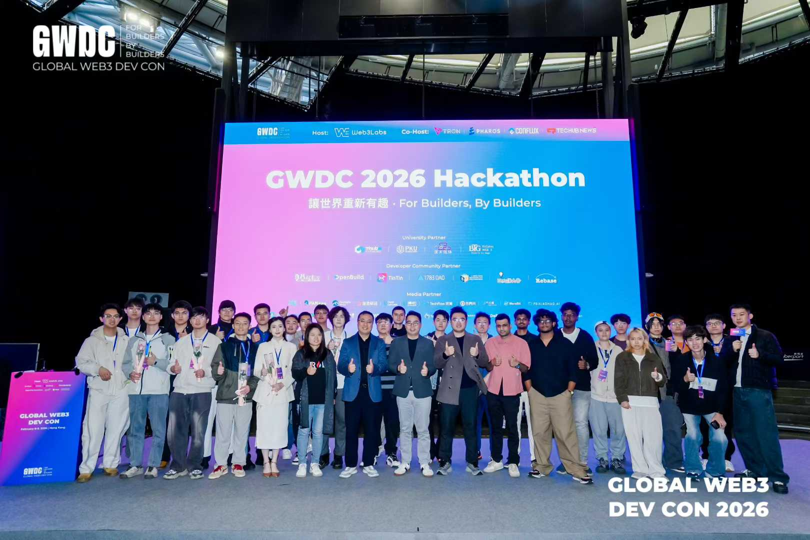
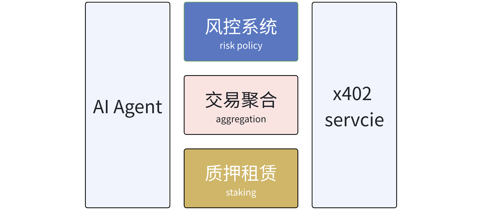
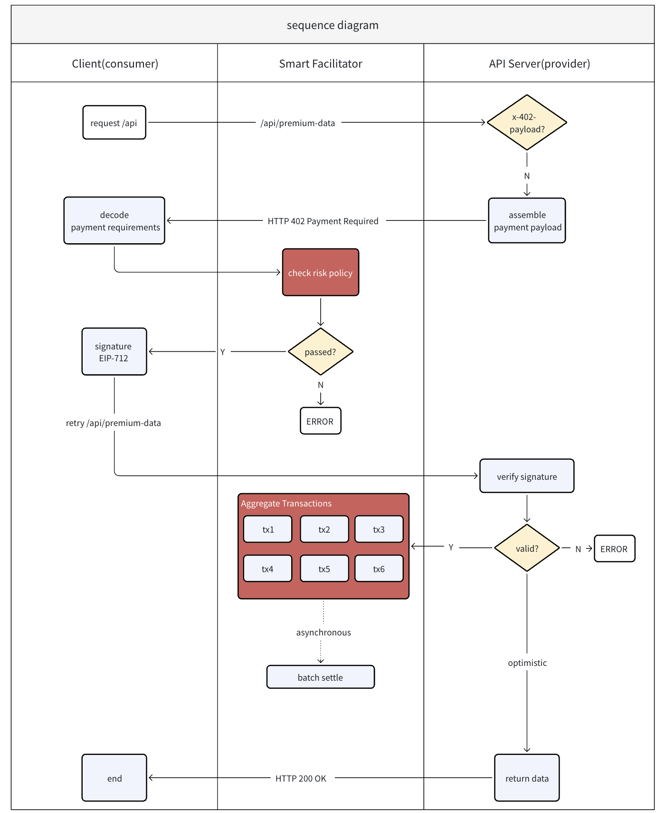
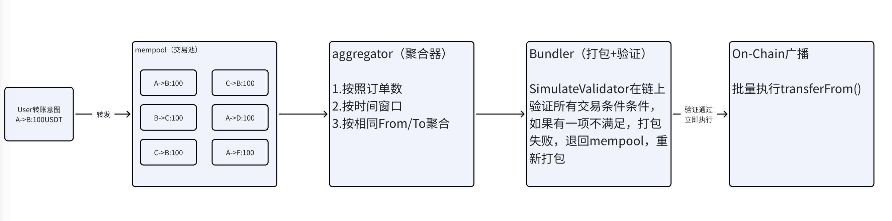

<h1 align="center">TFx402</h1>

<p align="center">
	<strong>Gasless</strong> • <strong>Secure</strong> • <strong>Profitable</strong>
</p>

<p align="center">
	🏆 <strong>GWDC 2026 WEB3 DEV 第三名</strong>
</p>

<p align="center">
	📣 <a href="https://x.com/LabsWeb368672/status/2021830657492889614" target="_blank"><strong>官方获奖公告（X / Twitter）</strong></a>
</p>

<table align="center">
	<tr>
		<td align="center"></td>
		<td align="center"></td>
	</tr>
</table>

<p align="center">
	相对 Tron 原生交易，手续费降低约 <strong>96.88%–98.54%</strong>
</p>

基于 Tron 的 AI Agent 智能 Facilitator，支持 x402 协议，聚焦低手续费支付、严格资金风控与可靠实时处理。

---

## 演示

[](https://www.youtube.com/watch?v=tvhliPdFTa8)

<p align="center">
	<a href="https://www.youtube.com/watch?v=tvhliPdFTa8" target="_blank">
		
	</a>
</p>

- [点击在 YouTube 播放](https://www.youtube.com/watch?v=tvhliPdFTa8)

## 为什么是 TFx402

- **更低成本**：单笔交易可低至 `0.2 TRX`，显著低于 Tron 原生典型成本。
- **原生 x402 支持**：兼容 x402 支付流程，便于接入 API 付费场景。
- **更强安全性**：多策略风控，可按场景配置交易放行规则。
- **更高吞吐**：高频交易聚合与乐观确认，提升用户体感实时性。
- **可持续收益**：支持闲置资金质押，增强 Energy 供给并降低长期成本。

## 技术栈

- **前端**：Next.js 15、React 18、TypeScript、Tailwind CSS、PostCSS
- **链交互**：TronWeb、ethers、viem、Particle Network AA / ConnectKit
- **后端**：Node.js、Express 5、WebSocket、JWT、dotenv、MCP SDK
- **支付协议**：@t402/core、@t402/tron、tron-x402
- **数据层**：MySQL（mysql2）、Redis（ioredis）
- **合约**：Solidity 0.8.6、TronBox
- **Demo / Agent**：XMTP SDK、axios

## 核心能力

- **高频聚合**：批量打包压缩链上成本，`simulateValidate` 预验证交易有效性。
- **风险控制**：支持多策略配置，覆盖小额免密、规则分层等场景。
- **质押增益**：预期年化 3%–5%，结合 JustLend Energy 租赁进一步降本。

## 对比

| 功能 | Tron 原生 | Coinbase x402 | TFx402 |
|------|-----------|---------------|--------|
| 交易手续费 | 约 6.4–13.74 TRX（约 1.92–4.12 USD，按 TRX ≈ 0.3 USD） | 0.001 USD / 笔 | 约 0.2 TRX / 笔 |
| USDT 转账 | 支持 | 不支持 | 支持 |
| 处理速度 | 标准 | 快速 | 高频聚合实时处理 |
| 资金安全 | 基础保障 | 标准风控 | 严格多策略风控 |
| 协议支持 | - | x402 | x402 |
| 闲置资金收益 | 无 | 无 | 3%–5% 年化质押增益 |
| 交易验证 | 单笔验证 | 单笔验证 | 链上批量模拟验证 |
| 链上交易参考 | [Tronscan 参考](https://nile.tronscan.org/#/transaction/58899848432d56f86bf8873a14cd9870ea5057b41c6ee9f3b79e615835ed0c07) | - | [Tronscan 参考](https://nile.tronscan.org/#/transaction/512823e2172d50903999c5b9902866076084af2237bdafab227f200d1902c2d4) |

## 快速开始

### 1) 前端

```bash
cd front-end
npm install
npm run dev
```

### 2) 后端

```bash
cd back-end
npm install
npm run dev
```

### 3) 合约

```bash
cd contract
tronbox compile
tronbox migrate --network nile
```

## Demo：x402 接入示例

### Server Side

```javascript
import { server } from 'tron-x402';

const { x402Gate } = server;

const SELLER_ADDRESS = 'TUzz9HKrE5sgzn5RmGKG35caEyqvawoKga';
const RESOURCE_PRICE = 1;

app.get(
	'/premium-data',
	x402Gate({
		recipient: SELLER_ADDRESS,
		price: RESOURCE_PRICE,
		asset: 'USDT',
		network: 'tron:0x2b6653dc',
		facilitator_url: 'xxxxxxx',
	}),
	(req, res) => {
		console.log('【test info】', req.payment);
		console.log(`[Success] Payment verified for Invoice: ${req.payment.invoiceId}`);

		res.json({
			status: 'success',
			data: '这里是价值 1 USDT 的核心付费数据...',
			receipt: {
				txId: req.payment.txId,
				from: req.payment.from,
				invoiceId: req.payment.invoiceId,
				amount: req.payment.value,
			},
		});
	}
);
```

### Client Side

```javascript
import { client } from 'tron-x402';

const { PaymentAgent } = client;

const agent = new PaymentAgent({
	privateKey: BUYER_PRIVATE_KEY,
	policyName: 'AutoGPT-shopping',
	maxBudget: 5000000,
	network: 'nile',
	facilitatorUrl: 'xxxxxx',
});

const response = await agent.get(SERVER_URL);
```

## 系统架构





基于标准 x402 协议，TFx402 新增两个关键环节：

1. **风控验证**：基于策略配置判断是否放行交易，可灵活配置策略组。
2. **交易聚合**：通过聚合器/打包器/验证器协同，降低链上成本并提升吞吐。



高频交易系统借鉴 L2 思路，以乐观确认方式缩短用户等待时间，并在短时间窗口内完成验证与上链，降低异常开销风险。


通过利用用户闲置资金提升 Energy 供给，进一步降低上链成本，同时提升用户留存与平台收益拓展空间。